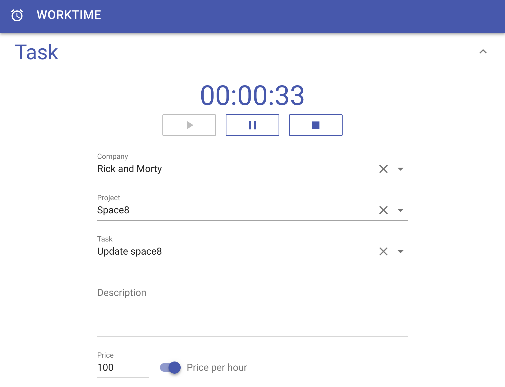
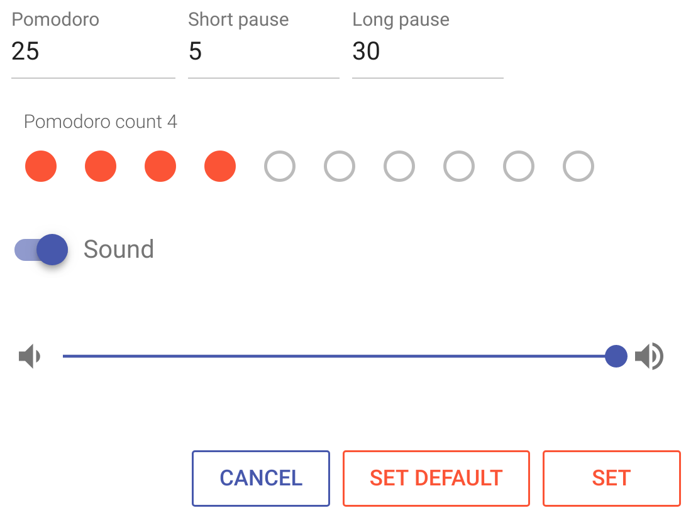
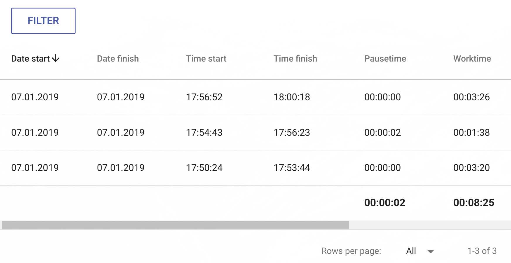
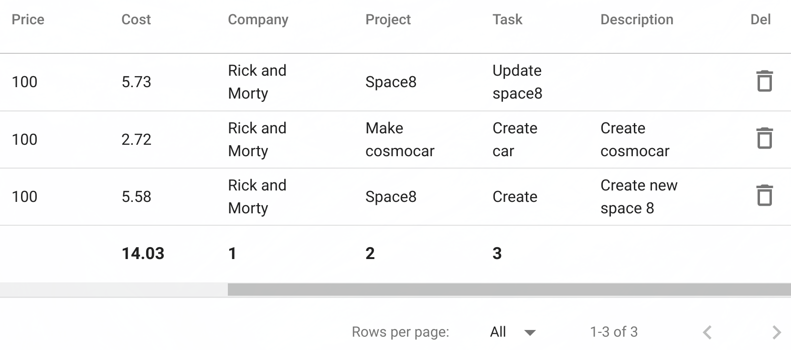
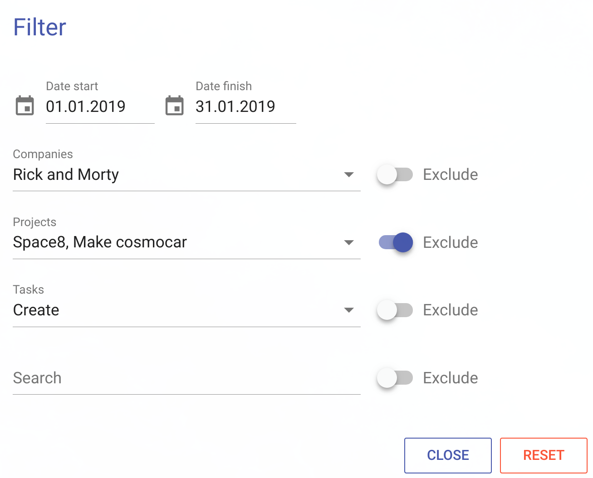
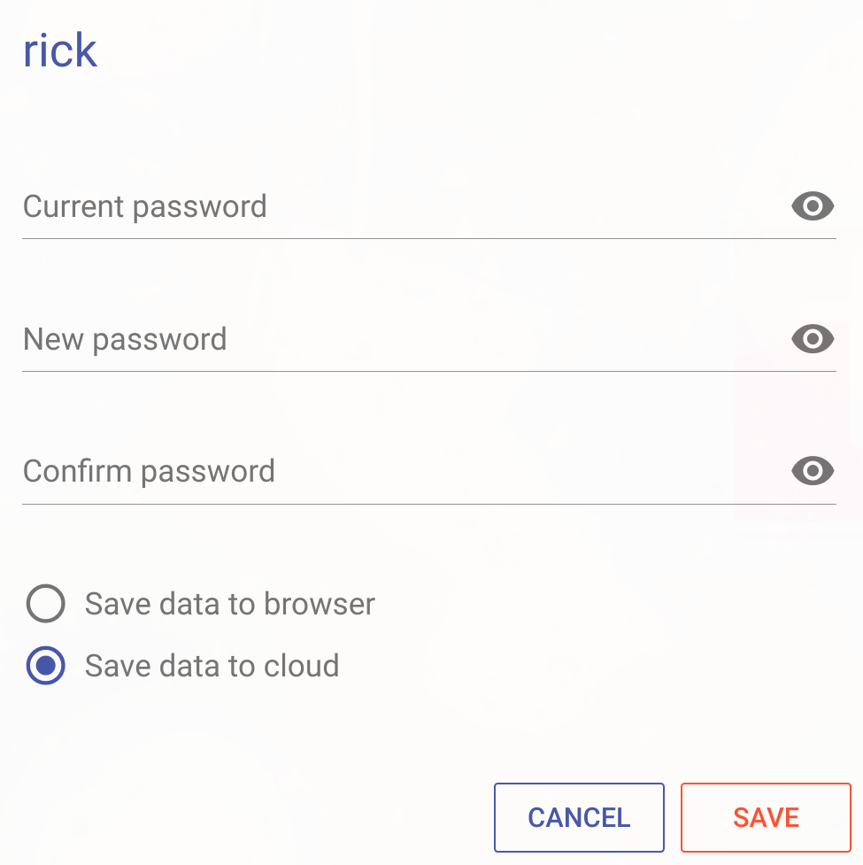
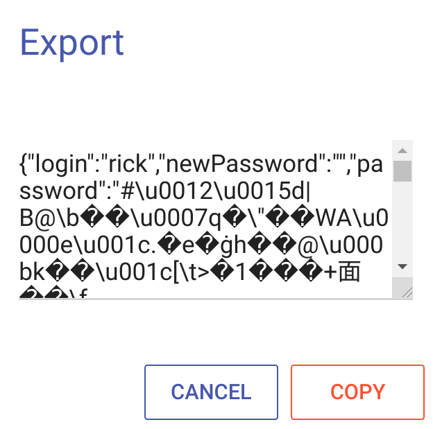
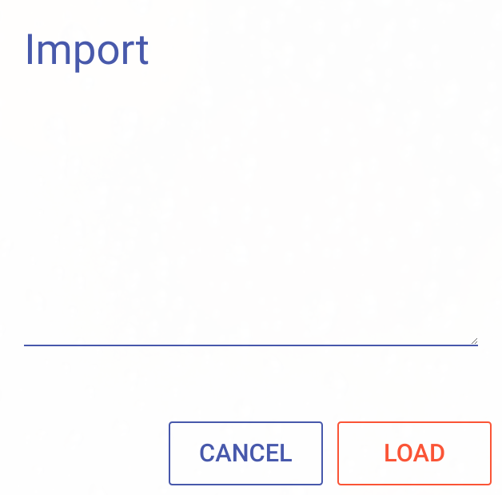

## About

**Worktime** — is a web application that keeps time and cost accounting of tasks. With the possibility of using technology "Pomodoro".

[Living example](https://rufus.pro/worktime/)

## Install

**Install Node.js** — install [Node.js](https://nodejs.org/en/download/).

**Install MongoDB** — install [MongoDB](https://www.mongodb.com/download-center/community). If data storage is planned only in the browser, then you can not install MongoDB.

**Worktime** — download [Worktime](https://github.com/jirufik/worktime) or <code>git clone https://github.com/jirufik/worktime.git</code>

**Npm** — install packages ```npm i```

**Config** — set up the application configuration in the file ```worktime/config/index.js```. The file contains two sections for execution environments: production and development.

*   **PORT** — the port on which the application will be available.
*   **BACKEND** — false data is stored only in the browser. true data can be stored in a browser or on a server.
*   **DBHOSTNAME** — is the MongoDB address. Filled with BACKEND: true.
*   **DBNAME** — MongoDB database. Filled with BACKEND: true.
*   **DBPORT** — is a MongoDB port. Filled with BACKEND: true.
*   **DBUSER** — is a MongoDB user. Filled with BACKEND: true.
*   **DBPASS** — is the password of the MongoDB user. Filled with BACKEND: true.
*   **pass.SALT** — salt to encrypt the password.
*   **pass.ITERATIONS** — the number of iterations.
*   **pass.HASH_LENGTH** — hash length.

**Start** — start application ```npm run startdev``` or ```npm run startprod```

## Task

**Task** — management of the current task.



**00:00:33** — elapsed time since the start of the task.

**Play** — start the task. The date of the start of the task is fixed.

**Pause** — pause the task. The pause time is not taken into account when the task is completed. The cost is not calculated at the time of the pause.

**Stop** — finish the task. The date of completion of the task is fixed. Calculates the time spent on the task and cost, without taking into account the pause time.

**Company** — the organization for which the task is performed.

**Project** — the project for which the task is executed.

**Task** — short name of the task.

**Description** — a detailed description of the task.

**Price** — the cost of the task.

**Price per hour** — cost per hour. If the sign is off, the cost for the entire task, without taking into account the time spent.

## Pomodoro

**Pomodoro** — is a time management method developed by Francesco Cirillo in the late 1980s. The technique uses a timer to break down work into intervals, traditionally 25 minutes in length, separated by short breaks.


**Underlying principles:**

**1** — Decide on the task to be done.

**2** — Set the pomodoro timer (traditionally to 25 minutes).

**3** — Work on the task.

**4** — End work when the timer rings and put a checkmark on a piece of paper.

**5** — If you have fewer than four checkmarks, take a short break (5 minutes), then go to step 2.

**6** — After four pomodoros, take a longer break (30 minutes), reset your checkmark count to zero, then go to step 1.

## Pomodoro settings



**Pomodoro** — the duration of the pomodoro (minutes).

**Short pause** — the duration of the short pause (minutes).

**Long pause** — the length of a long pause (minutes).

**Pomodoro count** — the number of pomodoroes before a long pause.

**Sound** — on / off. sound alert.

**Set** — apply settings.

**Set default** — set default settings.

## Worktime

**Worktime** — stores data about all previously completed tasks. Tasks can be selected using a filter.



**Date start** — the start date of the task.

**Date finish** — the task completion date.

**Time start** — the start time of the task.

**Time finish** — task completion time.

**Pausetime** — pause time. In the basement of all time pauses for filtered tasks.

**Worktime** — the total time to complete the task without taking pauses. In the basement of the entire execution time for filtered tasks.



**Price** — the price of the task.

**Cost** — task cost calculated from Worktime and Price. In the basement, the total cost of the filtered tasks.

**Company** — the company. In the basement of all the various companies on the filtered tasks.

**Project** — project. In the basement of all the various projects on the filtered tasks.

**Task** — a task. In the basement of all the various tasks on the filtered tasks.

**Description** — description of the task.

**Del** — delete the task.

## Filter

**Filter** — select completed tasks in Worktime by specified conditions.



**Date start** — the beginning of the period.

**Date finish** — the end of the period.

**Companies** — select tasks of selected companies. With Exclude enabled, select tasks excluding selected companies.

**Projects** — select tasks of selected projects. With Exclude enabled, select tasks excluding selected projects.

**Tasks** — select selected tasks. With Exclude enabled, select exclude selected tasks.

**Search** — string search. Select tasks that have a substring. When Exclude is enabled, select tasks that do not have a substring.

**Reset** — reset the filter.

## User settings

**User settings** — change password. Choose a data storage option.



**Current password** — current password.

**New password** — new password.

**Confirm password** — confirmation of the new password.

**Save data to browser** — store data in the browser. Data is stored in the current browser, on the current device. In another browser, on the current device, the data will not be available. No data is available on the other device. When choosing a storage option, the data is saved in the browser, the data is deleted on the server.

**Save data to cloud** — store data on the application server. Data is stored on the server. Data is available from other browsers and other devices. When you select a storage option, the data is saved to the server and deleted in the browser. The option is available if the application is running with the parameter BACKEND: true.

**Save** — apply changes to user settings.

## Export

**Export** — save data in JSON format.



**Copy** — copy JSON to clipboard.

## Import

**Import** — load data from JSON format.



**Load** — load data from JSON format. Current data will be deleted.