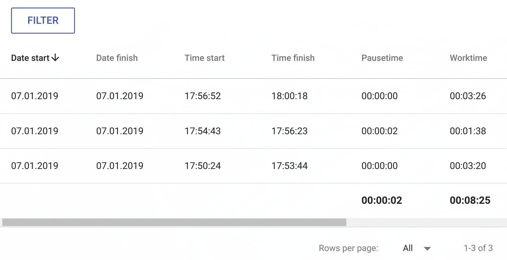
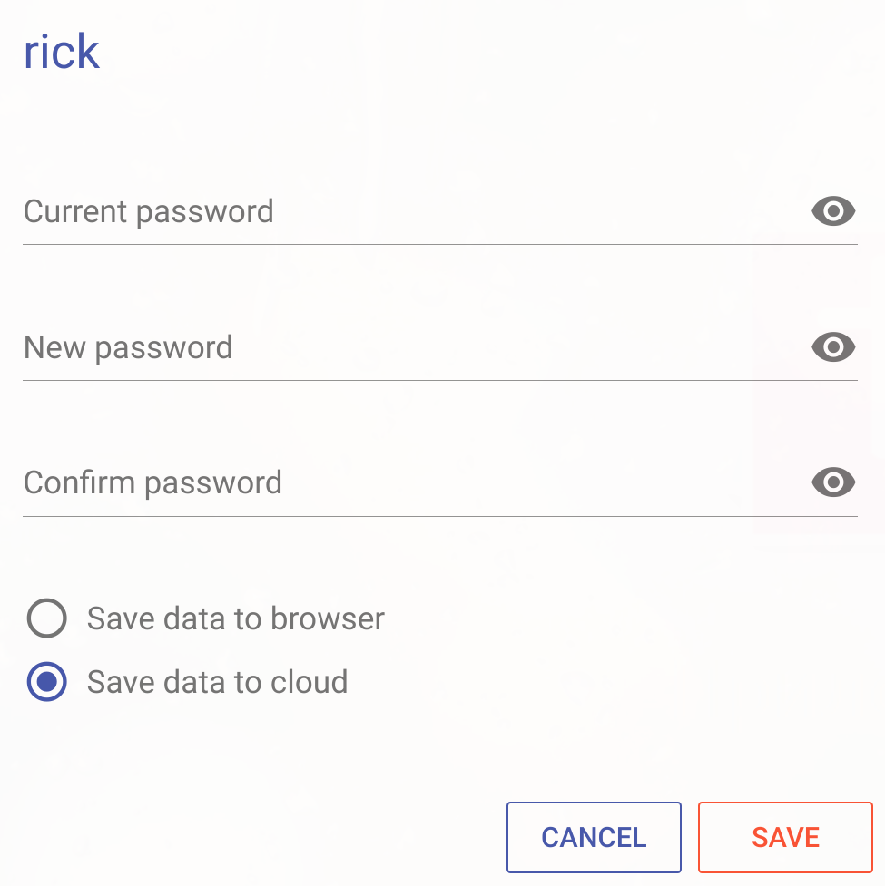
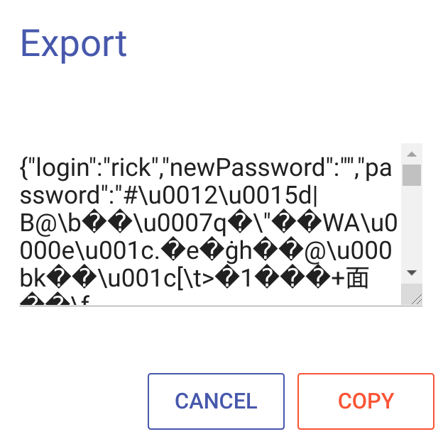

## About

**Worktime** — это web приложение которое ведет временной и стоимостной учет задач. С возможностью применения техники "Помидор".

## Install

**Install Node.js** — установите [Node.js](https://nodejs.org/en/download/).

**Install MongoDB** — установите [MongoDB](https://www.mongodb.com/download-center/community). Если хранение данных планируется только в браузере, то можно не устанавливать MongoDB.

**Worktime** — скачайте [Worktime](https://github.com/jirufik/worktime) или ```git clone https://github.com/jirufik/worktime.git```

**Npm** — установите пакеты ```npm i```

**Config** — настройте конфигурацию приложения в файле ```worktime/config/index.js```. Файл содержит два раздела, для сред исполнения: production и development.

*   **PORT** — порт по которому будет доступно приложение.
*   **BACKEND** — false данные хранятся только в браузере. true данные могут храниться в браузере или на сервере.
*   **DBHOSTNAME** — адрес MongoDB. Заполняется при BACKEND: true.
*   **DBNAME** — база MongoDB. Заполняется при BACKEND: true.
*   **DBPORT** — порт MongoDB. Заполняется при BACKEND: true.
*   **DBUSER** — пользователь MongoDB. Заполняется при BACKEND: true.
*   **DBPASS** — пароль пользователя MongoDB. Заполняется при BACKEND: true.
*   **pass.SALT** — соль для шифрования пароля.
*   **pass.ITERATIONS** — количество итераций.
*   **pass.HASH_LENGTH** — длина хэша.

**Start** — запуск приложения ```npm run startdev``` или ```npm run startprod```

## Task

**Task** — управление текущей задачей.


**00:00:33** — время прошедшее с момента начала выполнения задачи.

**Play** — начать выполнять задачу. Фиксируется датавремя начала выполнения задачи.

**Pause** — приостановить выполнение задачи. Время паузы не учитывается при окончании выполнения задачи. Стоимость не рассчитывается на время паузы.

**Stop** — закончить выполнение задачи. Фиксируется датавремя окончания выполнения задачи. Рассчитывается время затраченное на задачу и стоимость, без учета времени паузы.

**Company** — организация для которой выполняется задача.

**Project** — проект для которого выполняется задача.

**Task** — краткое наименование задачи.

**Description** — детальное описание задачи.

**Price** — стоимость задачи.

**Price per hour** — стоимость в час. Если признак выключен, то стоимость за всю задачу, без учета затраченного времени.

## Pomodoro

**Pomodoro** — техника управления временем, предложенная Франческо Чирилло в конце 1980-х. Техника предполагает разбиение задач на 25-минутные периоды, называемые «помидоры», сопровождаемые короткими перерывами.


**Принцип техники:**

**1** — определитесь с задачей, которую будете выполнять.

**2** — поставьте помидор (таймер) на 25 минут.

**3** — работайте, ни на что не отвлекаясь, пока таймер не прозвонит. Если что-то отвлекающее возникло у вас в голове, запишите это и немедленно возвращайтесь к работе.

**4** — сделайте короткий перерыв 5 минут.

**5** — после каждого 4-го «помидора» сделайте длинный перерыв 30 минут.

## Pomodoro settings


**Pomodoro** — длительность помидора (минуты).

**Short pause** — длительность короткой паузы (минуты).

**Long pause** — длительность длинной паузы (минуты).

**Pomodoro count** — количество помидоров до длинной паузы.

**Sound** — вкл/выкл. звуковое оповещение.

**Set** — применить настройки.

**Set default** — установить настройки по умолчанию.

## Worktime

**Worktime** — хранит данные о всех ранее выполненных задачах. Задачи можно отобрать с помощью фильтра.



**Date start** — дата начала выполнения задачи.

**Date finish** — дата завершения выполнения задачи.

**Time start** — время начала выполнения задачи.

**Time finish** — время завершения выполнения задачи.

**Pausetime** — время пауз. В подвале всего времени пауз по отфильтрованным задачам.

**Worktime** — общее время выполнения задачи без учета пауз. В подвале всего времени выполнения по отфильтрованным задачам.


**Price** — цена задачи.

**Cost** — стоимость задачи рассчитанная из Worktime и Price. В подвале суммарная стоимость по отфильтрованным задачам.

**Company** — компания. В подвале всего различных компаний по отфильтрованным задачам.

**Project** — проект. В подвале всего различных проектов по отфильтрованным задачам.

**Task** — задача. В подвале всего различных задач по отфильтрованным задачам.

**Description** — описание задачи.

**Del** — удалить задачу.

## Filter

**Filter** — отобрать выполненные задачи в Worktime по заданным условиям.


**Date start** — начало периода.

**Date finish** — окончание периода.

**Companies** — отобрать задачи выбранных компаний. При включенном Exclude, отобрать задачи исключая выбранные компании.

**Projects** — отобрать задачи выбранных проектов. При включенном Exclude, отобрать задачи исключая выбранные проекты.

**Tasks** — отобрать выбранные задачи. При включенном Exclude, отобрать исключая выбранные задачи.

**Search** — строковой поиск. Отобрать задачи у которых встречается подстрока. При включенном Exclude, отобрать задачи у которых не встречается подстрока.

**Reset** — сбросить фильтр.

## User settings

**User settings** — изменить пароль. Выбрать вариант хранения данных.



**Current password** — текущий пароль.

**New password** — новый пароль.

**Confirm password** — подтверждение нового пароля.

**Save data to browser** — хранить данные в браузере. Данные хранятся в текущем браузере, на текущем устройстве. В другом браузере, на текущем устройстве, данные будут не доступны. На другом устройстве данные не доступны. При выборе варианта хранения, данные сохраняются в браузере, на сервере данные удаляются.

**Save data to cloud** — хранить данные на сервере приложения. Данные сохраняются на сервере. Данные доступны из других браузеров и с других устройств. При выборе варианта хранения, данные сохраняются на сервер, в браузере удаляются. Вариант доступен, если приложение запущено с параметром BACKEND: true.

**Save** — применить изменения настроек пользователя.

## Export

**Export** — сохранить данные в JSON формате.



**Copy** — скопировать JSON в буфер обмена.

## Import

**Import** — загрузить данные из JSON формата.


**Load** — загрузить данные из JSON формата. Текущие данные будут удалены.